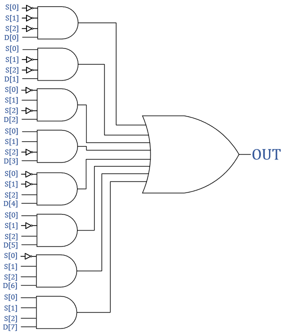

# Design of Digital Circuits

## Introduction

* **Moores Law**: Number of transistors double every tow years
* **Power of Abstraction**: A higher level only needs to know about the interface to the lower level, not how the lower level is implemented
* **Hamming Distance**: Number of locations in which the corresponding symbols of two equal-length strings are different

|Abstraction Levels|Description|
|---|---|
|Problem|
|Algorithm|Step-by-Step procedure that is guaranteed to terminate, each step is precisely stated and can be carried out by a computer|
|Program/Language|
|Runtime System Software|
|Software/Hardware Interface (ISA)|
|Microarchitecture|Implementation of the ISA
|Logic|Building blocks of micro-architecture
|Devices|
|Electrons|

## Four Mysteries

### Meltdown and Spectre

* Someone can steal secret data from the system even though
  * Your program and data are perfectly correct
  * Your hardware behaves according to the specification and
  * There are no software vulnerabilities/bugs
* Modern processors speculatively execute code to improve performance for branches
* **Speculative execution leaves traces of secret data in the processor’s cache**
* A malicious program can inspect the contents of the cache to infer secret data
* A malicious program can inspect the contents of the cache to infer secret data

### Rowhammer

* **Repeatedly reading a memory row enough times before the memory gets refreshed induces disturbance errors in adjacent rows in most real DRAM chips you can buy today**
* DRAM cells are too close to each other, they are not electrically isolated from each other
* When we activate (apply high voltage) to a row, an adjacent row gets slightly activated as well
* Vulnerable cells in that slightly-activated row lose a little bit of charge
* If this row hammer happens enough times, charge in such cells gets drained
* One exploit uses rowhammer-induced bit flips to gain kernel privileges

### Memory Performance Attacks

* **DRAM controllers are vulnerable to denial of service attacks, we can write programs to exploit unfairness**

### DRAM Refresh

* DRAM capacitor charge leaks over time
* **The memory controller needs to refresh each row periodically to restore charge**
* Downsides of refresh
  * Energy consumption: Each refresh consumes energy
  * Performance degradation: DRAM rank/bank unavailable while refreshed
  * QoS/predictability impact: (Long) pause times during refresh
  * Refresh rate limits DRAM capacity scaling

#### Eliminating Unnecessary DRAM Refreshes

* Observation: The overwhelming majority of DRAM rows can be refreshed much less often without losing data
* Idea: Refresh weak rows more frequently, all other rows less frequently

#### Exercise

A supercomuter has a DRAM-based memory system with the following configuration:

* Total capacity: 1 EB
* DRAM row size: 8 KB
* In order to ensure that no data is lost, every DRAM row is refreshed once every 64 ms

1. How many DRAM rows does the memory system have?
   * `1 EB = 2^60, 8 KB = 2^13, 2^60 / 2^13 = 2^47 rows`
2. How many DRAM refreshes happen in 64ms?
   * Because each row needs to be refreshed every 64ms, all rows need to be refreshed within 64ms.Thus, the number of refreshes in 64 ms is equal to the number of rows 2^47
3. What is the power consumption of DRAM refresh?
   * Let `P_refresh` be the power consumption of the DRAM device while performing only refresh operations. To find that number, we can use `P_refresh = IDD5B ∗ V_DD`, where `IDD5B` is the average current consumption while the DRAM device is being continuously refreshed. Both `IDD5B` and `V_DD` can be found in the [datasheet](https://safari.ethz.ch/digitaltechnik/spring2019/lib/exe/fetch.php?media=1gb_ddr3_sdram.pdf). There are many different `IDD5B` parameters to pick from in the datasheet depending on the types of DRAM we are assuming. If we assume DDR3-1066 with `IDD5B = 160mA` (as can be seen in Table 19 in the datasheet), `P_refresh = 160 mA ∗ 1.5 V = 240 mW`.
4. What is the total energy consumption of DRAM refresh during a refresh cycle? And during a day?
   * `Energy = Power * Time`. `Power` is P_refresh from part 3. It `Time` is 64 ms (a refresh cycle), `Energy` is `E = 240 mW * 64 ms = 1.54 * 10^-2 J`. If `Time` is a day, `Energy` is `E = 2.07 * 10^4 J`.

A machine has a 4 GB DRAM main memory system. Each row is refreshed every 64 ms.

1. The machine’s designer runs two applications A and B (each run alone) on the machine. Although applications A and B have a similar number of memory requests, application A spends a surprisingly larger fraction of cycles stalling for memory than application B does? What might be the reasons for this?
   * A large number of application A’s memory requests are row-buffer conflicts, whereas a large number of application B’s memory requests are row-buffer hits. Hence, application A’s requests take longer to service and it spends more time stalling for memory.
2. Application A also consumes a much larger amount of memory energy than application B does. What might be the reasons for this?
   * A row-buffer conflict consumes more energy than a row-buffer hit. A row-buffer conflict requires a precharge, an activate and a read/write, whereas a row-buffer hit only requires a read/write. Hence, application A consumes more memory energy.
3. When applications A and B are run together on the machine, application A’s performance degrades significantly, while application B’s performance does not degrade as much. Why might this happen?
   * When the applications are run together, they interfere with each other. Hence, both applications’ performance degrades when they run together. However, if a memory scheduler that favors row-buffer hits over row-buffer conflicts (like FR-FCFS) is used, it would favor application B’s requests over application A’s requests. Therefore, application A’s performance degrades more.
4. The designer decides to use a smarter policy to refresh the memory. A row is refreshed only if it has not been accessed in the past 64 ms. Do you think this is a good idea? Why or why not?
   * This can reduce refresh energy significantly if a large fraction of the rows in memory contain data and are accessed (within the 64 ms refresh window), as these rows do not have to be refreshed explicitly. However, if only a small number of rows contain data and only these rows are accessed, this policy will not provide much reduction in refresh energy as a large fraction of rows are still refreshed at the 64 ms rate.
5. When this new refresh policy is applied, the refresh energy consumption drops significantly during a run of application B. In contrast, during a run of application A, the refresh energy consumption reduces only slightly. Is this possible? Why or why not?
   * This is possible. If application B has a large working set, it could access a large fraction of the memory rows (within the 64 ms refresh window) and hence these rows do not have to be refreshed explicitly. On the other hand, application A could have a much smaller working set and hence a large fraction of rows still have to be refreshed at the 64 ms rate.

## Boolean Algebra

* not A: `Ā` (In this summary: `¬A`) 
* A and B: `A • B` (In this summary: `A * B`)
* A or B: `A + B`
* Duality: A dual of a Boolean expression is derived by replacing
  * Every AND operation with an OR operation
  * Every OR operation with an AND operation
  * Every constant 1 with a constant 0
  * Every constant 0 with a constant 1
  * Don’t change any of the literals or play with the complements

Operations with 0 and 1
```
X + 0 = X
X + 1 = 1
X * 1 = X
X * 0 = 0
```

Idempotent Law
```
X + X = X
X * X = X
```

Involution Law
```
¬(¬X) = X
```

Laws of Complementarity
```
X + ¬X = 1
X * ¬X = 0
```

Commutative Law
```
X + Y = Y + X
X * Y = Y * X
```

Associative Laws
```
(X + Y) + Z = X + (Y + Z) = X + Y + Z
(X * Y) * Z = X * (Y * Z) = X * Y * Z
```

Distributive Laws
```
X * (Y + Z) = (X * Y) + (X * Z)
X + (Y * Z) = (X + Y) * (X + Z)
```

Simplification Theorems
```
X * Y + X * ¬Y = X
X + X * Y = X
(X + ¬Y) * Y = X * Y
(X + Y) * (X + ¬Y) = X
X * (X + Y) = X
(X * ¬Y) + Y = X + Y
```

De Morgan's Law
```
¬(X + Y + Z + ...) = ¬X * ¬Y * ¬Z * ...
¬(X * Y * Z * ...) = ¬X + ¬Y + ¬Z + ...
```

* **Complement**: Inverted variables (`¬A`)
* **Literal**: Variables or complements (`A`, `¬A`)
* **Implicant**: Product of literals (`¬A * B`)
* **Minterm**: Product that includes all input variables (`A * B * ¬C`)
* **Maxterm**: Sum that includes all input variables (`A + ¬B + ¬C`)

**Sum of Products Form, Disjunctive Normal Form, Minterm Expansion**

Example
```
(¬A * B * C) + (A * ¬B * ¬C) + (A * ¬B * C)
```

In the truth table, we can build a minterm from each row, when a variable is zero, we write the variable inverted. We add all minterms where the result is true.

Example

|A|B|C|Minterms|
|---|---|---|---|
|0|0|0|`¬A * ¬B * ¬C = m1`|
|1|0|0|`A * ¬B * ¬C = m2`|
|...|||

Canonical form
```
F(A, B, C) = ∑m(3, 4, 5, 6, 7) = m3 + m4 + m5 + m6 + m7
```

**Product of Sums Form, Conjunctive Normal Form, Maxterm Expansion**

Example

```
(¬A + B + C) * (A + ¬B + ¬C) * (A + ¬B + C)
```

In the truth table, we can build a maxterm from each row, when a variable is one, we write the variable inverted. We multiply all maxterms where the result is false.

Example

|A|B|C|Maxterms|
|---|---|---|---|
|0|0|0|`A * B * C = M1`|
|1|0|0|`¬A * B * C = M2`|
|...|||

Canonical form
```
F(A, B, C) = ΠM(0, 1, 2) = m1 + m2 + m3
```

The sum-of-products form and the product-of-sums form can be easily implemented with logic gates.

Example: `Y = (¬A * ¬B * ¬C) + (A * ¬B * ¬C) + (A * ¬B * C)`


Minterms and maxterms can be easily translated, for example `∑m(3, 4, 5, 6, 7) = ΠM(0, 1, 2)`, all indices except the ones in the first term are used to build the second term, and the other way around.

Furthermore, if `F(A, B, C) = ∑m(3, 4, 5, 6, 7)`, then `¬F(A, B, C) = ∑m(0, 1, 2)`.

## What is a Computer

* A computer has three main components
  * Computation
  * Communication
  * Memory

### FPGAs

* Field Programmable Gate Array
* Reconfigurable, flexible hardware
* Two main building blocks
  * **Look-Up Tables (LUT)**: Can implement any 3 bit input function
  * **Switches**: Connect the LUTs
* Programmable with Verilog or VHDL

### Microprocessors

* Common building block of comupters
* Programmable with C, C++, Java, ...

### MOS Transistors

*Abstraction Layer: Devices*

* **M**etal **O**xide **S**emiconductors are combined to build a transistor
* By combining many transistors we can build simple logic gates
* N-Type Transistor: If the gate is supplied with a high voltage, the connection from source to drain acts like a piece of wire, otherwise the connection is broken
* P-Type Transistor: This transistor works analogous to the N-Type Transistor, except the gate is open when supplied with a low voltage

### Logic Gates

*Abstraction Layer: Logic*

* Basic logic structures are constructed out of individual MOS transistors
* Logic gates implement simple boolean functions
* A set of gates is logically complete if we can build a circuit for any truth table we wish without any other kind of gate (Example: AND, OR, NOT)

|Gate|MOS Transistor Construction|
|---|---|
|NOT||
|NAND||
|AND||

* General form used to construct any inverting logic gate
  * The networks may consist of transistors in series or in parallel
  * When transistors are in parallel, the network is *ON* if one of the transistors is *ON*
  * When transistors are in series, the network is *ON* only if all transistors are *ON*
  * pMOS transistors are used for pull-up, they pass high voltages well
  * nMOS transistors are used for pull-down, they pass low volatges well
  * Exactly one network should be *ON*, and the other network should be *OFF* at any given time
  * Series connections are slower than parallel connections, pseudo nMOS logic can be used as an alternative
* **Dynamic Power Consumption**: `C * V^2 * f`, `C` is the capacitance of the circuit, `V` is the supply voltage, `f` is the charging frequency of the capacitor
* **Static Power Consumption**: `V * I_leakage`


* Logic gates can be extended to three or more inputs

#### Exercise

Design the following circuits using only CMOS transistors (p-type and n-type MOS transistors).

|Gate|MOS Transistor Construction|
|---|---|
|XOR||
|XNOR||

We know that the gates AND, OR and NOT are logically complete. To show that the set of only a NOR gate is logically complete, build the AND, OR and NOT gates using only NOR gates.


### Logic Circuits

* A logic circuit is composed of inputs and outputs
* The **functional specification** describes relationship between inputs and outputs
* The **timing specification** describes the delay between inputs changing and outputs responding

### Combinational Building Blocks

#### Decoder

It has `n` inputs and `n^2` outputs, where exactly one output is 1 and the rest are 0s.


#### Multiplexer

Selects one of the `n` inputs to connect it to the output, needs a `log_2(n)`-bit control input.


#### Full Adder

Does binary addition, similar to decimal addition.


#### Tri-State Buffer

Enables gating of different signals onto a wire.


`Z`: Signal that is not driven by any circuit

#### Basic Storage Elements

##### R-S Latch


##### Gated D Latch


##### Gated-D-Latch-Based Register

Multiple gated D latches to store more data.


##### D Flip-Flop

Modification of gated D latch to work with finite state machines. When the clock is low, the master propagates the signal to the slave, only when the clock is high, the slave latches the signal.


###### Enabled Flip-Flops

The enable input (EN) controls when new data is stored.


###### Resettable Flip-Flops

The reset is used to set the output to 0, the **synchronous** resettable flip-flop resets only at the clock edge, the **asynchronous** resettable flip-flop resets immediately when reset is 1.


###### Settable Flip-Flop

If set is 1, the output is set to 1.


##### D-Flip-Flop-Based Register

Multiple D flip-flops to store more data.


#### Programmable Logic Array

With a PLA, any logic function can be implemented. The PLA consists of an array of AND gates followed by an array of OR gates, where the AND gates form the products in the sum-of-products form, and the OR gates form the sum.


#### Exercise

Draw an 8-input multiplexer on the gate level using only AND, OR and NOT gates. Use as few gates as possible.



Draw an 8-input multiplexer on the module level using only 2-input multiplexers. Use as few multiplexers as possible.


### Memory

* Memory is locations that can be written to or read from
* Every unique location in memory is indexed with a unique **address**. `n` locations require `log_2(n)` address bits.
* **Addressability**: the number of bits of information stored in each location.
* The entire set of unique locations in memory is referred to as the **address space**


## Sequential and Combinational Logic Circuits

### Combinational Logic Circuits

* Only depends on current inputs

#### Combinational Timing

* Digital logic is an abstraction, in reality, outputs are delayed from the inputs as the transistors take a finite amount of time to switch
* Delay is caused by
  * The capacitance and resistance in a circuit
  * The speed of light
* The delay also depends on the voltage and temparature
* **Contamination Delay** (`t_cd`): Delay until the output starts changing, the total contamination delay of a circuit is calculated by adding all the contamination delays in the shortest path
* **Propagation Delay** (`t_pd`): Delay until the output finishes changing, the total propagation delay of a circuit is calculated by adding all the propagation delays in the longest path

#### Glitches

* **Glitch**: One input transition causes multiple output transitions
* Glitches are visible in K-Maps


* Glitches can be avoided by adding in the consensus term


* We don't necessarily have to fix glitches as the circuit eventually is guaranteed to converge to the right value

### Sequential Logic Circuits

* Depends on current and past inputs
* The state of the logic circuits is a snapshot of all relevant elements at this moment
* A clock dictates when to change state, at the start of the clock cycle, the system state changes


#### Sequential Timing

* Signals must be stable when sampled by a flip-flop, specifically, the input must be stable at least `t_setup` before the clock edge and `t_hold` after the clock edge
* **Setup Time** (`t_setup`): Time before the clock edge that data must be stable
* **Hold Time** (`t_hold`): Time after the clock edge that data must be stable
* **Aperture Time** (`t_a`): Time around the clock edge that data must be stable (`t_a = t_setup + t_hold`)


* **Contamination Delay clock-to-q** (`t_ccq`): Earliest time after the clock edge that the output of a flip-flop starts changing
* **Propagation Delay clock-to-q** (`t_pcq`): Latest time after the clock edge that the output of a flip-flop stops changing


* **Sequencing Overhead**: The time wasted with not doing useful work `t_pcq + t_setup`
* **Critical Path**: Path with the longest `t_pd`
  * If too long, the design will run slowly
  * If too short, each cycle will do very little useful work
* **Clock Skew**: The clock does not reach all parts of the chip at the same time
* **Safe Timing** 
  * D2 must be stable for at least `t_setup` before the clock edge: Total time `T_c` of a sequential circuit is `T_c > t_pcq + t_pd + t_setup`
  * D2 must be stable for at least `t_hold` after the clock edge: `t_ccq + t_cd > t_hold`, thus there needs to be a minimum contamination delay `t_cd > t_hold - t_ccq`, this is not dependant on `T_c`
  * The maximum frequency `f_max = 1 / T_c`
  * Requires considering the worst-case clock skew, which increases `t_setup` and `t_hold` by `t_skew`, the worst case skew


### Circuit Verification

* Is the circuit functionally corrrect?
* Does the hardware meet all timing constraints?

#### Functional Verification

* Test the logical correctness of the design
* Tested on a high level for performance gain

```
module testbench();
    reg a, b, c;
    wire y;
    
    sillyfunction dut(.a(a), .b(b), .c(c), .y(y));
    initial begin
        a = 0; b = 0; c = 0; #10; // apply input, wait 10ns
        if(y !== 1) $display("000 failed."); // check result
        c = 1; #10;
        if(y !== 0) $display("001 failed.");
        b = 1; c = 0; #10;
        if(y !== 0) $display("010 failed.");
    end
endmodule
```

#### Timing Verification

* Test the timing specifications of the design
* Can be made with `#x` statements on a high level or on a low level after synthesizing the design to acutal circuits

### Exercise

Is the following code sequential or combinational?

```
module concat (input clk, input  data_in1, input data_in2, output reg  [1:0] data_out);
    always @ (posedge clk, data_in1) if (data_in1)
        data_out = {data_in1, data_in2};
    else if (data_in2)
        data_out = {data_in2, data_in1};
endmodule
```

This code results in a sequential circuit, because `data_in2` is not in the sensitivity list, and thus `data_out` will always be `{data_in1, data_in2}`.

### Finite State Machines

* Finite state machines are dicrete-time models of a stateful system
* A FSM shows the set of all possible states of a system and how the system transitions from one state to another
* A FSM consists of five elements
  * A finite number of states
  * A finite number of external inputs
  * A finite number of external outputs
  * An explicit specification of all state transisitons
  * An explicit specification of what determines each external output value
* A FSM consists of three separate parts
  * Next state logic
  * State register
  * Output logic
* States can be encoded in different ways
  * **Fully Encoded**: Minimizes the amount of flip-flops, but not necessarily the output logic (00, 01, 10, 11)
  * **1-Hot Encoded**: Minimizes the next state logic, but maximizes the amount of flip-flops (0001, 0010, 0100, 1000)
  * **Output Encoded**: Minimizes the output logic as the outputs are directly accessible in the state encoding, only works for moore machines (001, 010, 100, 110 for the swiss traffic light)

* **Moore FSM**: Outputs depend only on the current state


* **Mealy FSM**: Outputs depend on the current state and the inputs


#### Transition Diagrams, State Transition Tables, Output Tables


|Current State|Inputs||Next State|
|---|---|---|---|
|S|T_A|T_B|S'|
|S0|0|X|S1|
|S0|1|X|S0|
|S1|X|X|S2|
|S2|X|0|S3|
|S2|X|1|S2|
|S3|X|X|S0|

|State|Encoding|
|---|---|
|S0|00|
|S1|01|
|S2|10|
|S3|11|

```
S'_1 = (¬S_1 * S_0) + (S_1 * ¬S_0 * ¬T_B) + (S_1 * ¬S_0 * T_B) = S_1 XOR S_0
S'_0 = (¬S_1 * ¬S_0 * ¬T_A) + (S_1 * ¬S_0 * ¬T_B)
```

|Current State|Outputs||
|---|---|---|
|S|L_A|L_B|
|S0|green|red|
|S1|yellow|red|
|S2|red|green|
|S3|red|yellow|

|Output|Encoding|
|---|---|
|green|00|
|yellow|01|
|red|10|

```
L_A1 = S_1
L_A0 = ¬S_1 * S_0
L_B1 = ¬S_1
L_B0 = S_1 * S_0
```

From this information we can implement this finite state machine as a logic circuit. Furthermore we can draw the following timing diagram for any given clock, reset, and input signals.


### Exercise


1. Which critical component is missing in the FSM diagram above?
   * The reset indication for the inital state.
2. What kind of FSM is this?
   * Moore FSM

## Karnaugh Maps

* Boolean expressions can be reduced to fewer terms
* K-Maps help to visualize adjacencies in up to six dimensions


## Tradeoffs in Circuit Design

* **Area**: Circuit area is proportional to the cost of the device
* **Speed**: Circuit should be as fast as possible
* **Power**: Power consumption should be as small as possible
* **Design Time**: Design time should be as small as possible, designers are expensive

## Verilog

* Verilog is a hardware description language (HDL)
* Can be used to simulate the behavior of circuits and synthesize portions of it
* Modules are the main building block in Verilog
* **Structural HDL Implementation**: Module body contains gate-level description of the circuit
* **Behavioral HDL Implementation**: Module body contains functional description of the circuit (Higher level of abstraction than structural HDL implementation)


Modules

```
module test 
(
    input a,
    input b,
    output y 
);

endmodule
```

Multi-Bit Input/Outputs

```
input [31:0] a;
```

Wires

* Wires are used to connect modules within other modules

```
module top (A, SEL, C, Y);
    input A, SEL, C;
    output Y;
    wire n1;

    small i_first(.A(A), .B(SEL), .Y(n1));
    small i_second(.A(n1), .B(C), .Y(Y));

endmodule
```

Bitwise Operators

```
module example (a, b, c, y);
    input a;
    input b;
    input c;
    output y;
    
    assign y1 = a & b;    // AND
    assign y2 = a | b;    // OR
    assign y3 = a ^ b;    // XOR
    assign y4 = ~(a & b); // NAND
    assign y5 = ~(a | b); // NOR

endmodule
```

Reduction Operators

```
module and8 (
    input [7:0] a,
    output y
);

    assign y = &a;

endmodule
```

Conditional Assignment
```
module mux2(
    input [3:0] d0, d1,
    input s,
    output [3:0] y
);

    assign y = s ? d1 : d0;

endmodule
```

Precedence of Operations

* The operators on top have the highest precedence

|Symbol|Operation|
|---|---|
|~|NOT|
|*, /, %|mult, div, mod|
|+, -|add, sub|
|<<, >>|shift|
|<<<, >>>|arithmetic shift|
|<, <=, >, >=|comparison|
|==, !=|equal, not equal|
|&, ~&|AND, NAND|
|^, ~^|XOR, XNOR|
|\|, ~\||OR, NOR|
|?:|ternary operator|

Express Numbers

`N'Bxx`
* `N` Number of bits
* `B` Base, can be `b` (binary), `h` (hexadecimal), `d` (decimal), `o` (octal)
* `xx` Number, can have `X` and `Z` as values, underscores can be used to improve readability

|Verilog|Stored Number|
|---|---|
|`4'b1001`|1001|
|`4'd5`|0101|
|`12'hFA3`|111110100011|
|`12'h0`|000000000000|

Parameterized Modules

```
module mux2 #(parameter width = 8) (
    input [width-1:0] d0, d1,
    input s,
    output [width-1:0] y);
     
    assign y = s ? d1 : d0;

endmodule

// instantiation

mux2 mux2_8 (d0, d1, s, out);
mux #(12) mux2_12 (d0, d1, s, out);
```

Sequential Logic

* `posedge` defines a rising edge, the statement is executed when the stated signal rises
* `negedge` defines a falling edge, the statement is executed when the stated signal falls
* `always @ (*)` can be used to add all right-hand side signals to the sensitivity list
* Assigned variables need to be declared as `reg`
* `<=` describes a non-blocking assignment, all non-blocking assignments are made at the end of the block in parallel
* `=` describes a blocking assignment, they are made immediately and the process blocks progress
* `if ... else` can only be used in `always` blocks
* The `always` block is combinational only if all `reg`s within the block are always assigned to a signal
* `always @ (posedge clk)` and non-blocking assignments `<=` are used to model sequential logic
* `always @ (*)` and blocking assignments `=` are used to model combinational logic
* Assignments to the same signal cannot be made in more than one `always` block

```
module flop(
    input clk, input[3:0] d, output reg[3:0] q);
    
    always@ (posedge clk)
        q <= d;
        
endmodule
```

* **Little Endian Format**: Bits are numbered from right to left, starting at the little end
* **Big Endian Format**: Bits are numbered from left to right, starting at the big end

## Instruction Set Architecture

### MIPS Instruction Set Architecture

### Exercise

Rewrite the following program in MIPS assembly.

```
int fib(int n){
    int a = 0;
    int b = 1;
    int c = a + b;
    while (n > 1) {
        c = a + b;
        a = b;
        b = c;
        n--;
    }
    return c;
}
```

```
fib:
    addi $sp, $sp, -16 // allocate stack space
    sw   $16, 0($sp)   // save r16
    add  $16, $4,  $0  // r16 for arg n
    sw   $17, 4($sp)   // save r17
    add  $17, $0,  $0  // r17 for a, init to 0
    sw   $18, 8($sp)   // save r18
    addi $18, $0,  1   // r18 for b, init to 1
    sw   $31, 12($sp)  // save return address
    add  $2,  $17, $18 // c = a + b
branch:
    slti $3,  $16, 2   // use r3 as temp
    bne  $3,  $0,  done
    add  $2,  $17, $18 // c = a + b
    add  $17, $18, $0  // a = b
    add  $18, $2,  $0  // b = c
    addi $16, $16, -1  // n = n - 1j    branchdone:
    lw   $31, 12($sp)  // restore r31
    lw   $18, 8($sp)   // restore r18
    lw   $17, 4($sp)   // restore r17
    lw   $16, 0($sp)   // restore r16
    addi $sp, $sp, 16  // restore stack pointer
    jr   $31           // return to caller
```

Classify the following attributes as either a property of its microarchitecture or ISA.

|Attribute|Microarchitecture|ISA|
|---|---|---|
|The machine does not have a subtract instruction||x|
|The ALU of the machine does not have a subtract unit|x||
|The machine does not have condition codes||x|
|A 5-bit immediate can be specified in an ADD instruction||x|
|It takes n cycles to execute an ADD instruction|x||
|There are 8 general purpose registers||x|
|A 2-to-1 mux feeds one of the inputs to ALU|x||
|The register file has one input port and two output ports|x||

1. If a given program runs on a processor with a higher frequency, does it imply that the processor always executes more instructions per second, compared to a processor with a lower frequency?
   * No, it also depends on the amount of instructions per cycle (IPC).
2. If a processor executes more of a given program’s instructions per second, does it imply that the processor always finishes the program faster, compared to a processor that executes fewer instructions per second?
   * No, the total number of instructions required to execute a program may vary depending on the specific ISA.

## Data Flow Programs