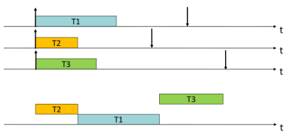
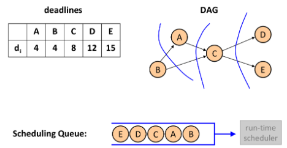
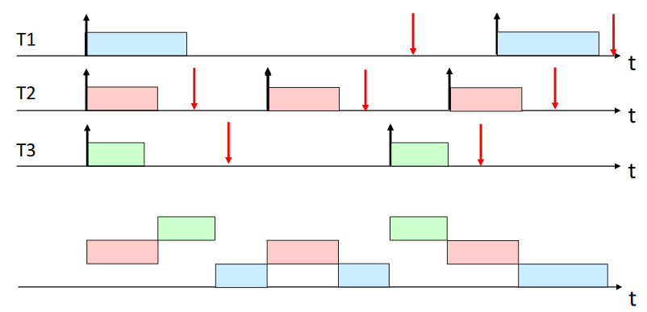
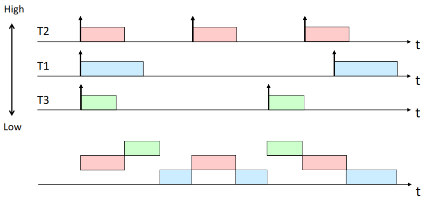
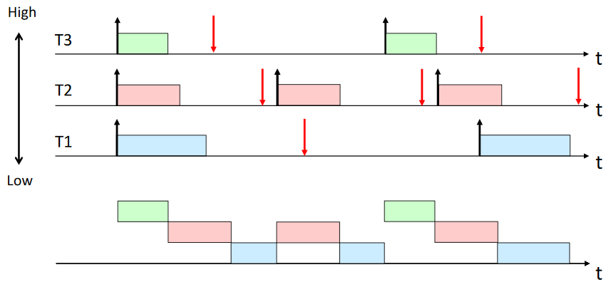
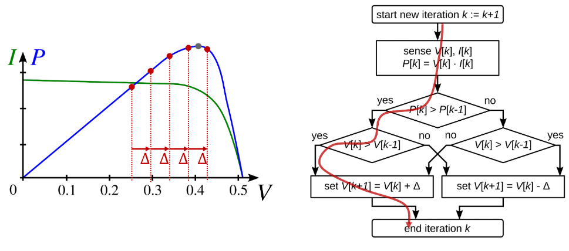

## Communication

### UART

#### Start/Stop Bits

Used for synchronization.

#### Data Bits

Actually transfers the data.

#### Parity Bit

Detects potential errors.

#### Baudrate

Speed of communication over a channel.

### Interrupts

Interrupts are implemented in hardware, always have a higher priority than any other task.

### Polling

## Scheduling

### Cyclic-Executive Scheduling

|Symbols|Definitions|
|---|---|
|$\Gamma$|Task set|
|$\tau_i$|Task|
|$T_i$|Period of task $\tau_i$|
|$\phi_i$|Phase of $\tau_i$|
|$D_i = d_{i,j} - r_{i,j}$|Relative deadline of task $\tau_i$|
|$C_i$|Worst case execution time of task $\tau_i$|
|$\tau_{i,j}$|Job, $j$-th instance of task $\tau_i$|
|$r_{i,j} = \phi_i + (j-1) T_i$|Release time of job $\tau_{i,j}$|
|$d_{i,j} = \phi_i + (j-1) T_i + D_i$|Absolute deadline of job $\tau_{i,j}$|

#### Feasibility

A schedule is feasible/correct if:

1. The period $P$ is a common multiple of all task periods
2. The period $P$ is a multiple of the frame length $f$
3. The frame $f$ has to be sufficiently long: $\forall 1 \leq k \leq \frac{P}{f}: \sum \limits_{i \mid f_{i,j} = k} C_i \leq f$
4. The realese times are respected (Or offsets have to be determined such that instances start after release time: $\forall \tau_i: \phi_i = \min \limits_{1 \leq j \leq P/T_i} (f_{i,j} - 1)f-(j-1) T_i)$)
5. The deadlines are respected: $\forall \tau_i, 1 \leq j \leq \frac{P}{T_i}: (j - 1) T_i + \phi_i + D_i \geq f_{i,j} f$

### Aperiodic Task Scheduling

||Equal arrival times,$\newline$Non preemptive|Arbitrary arrival times,$\newline$Preemptive|
|---|---|---|
|Independent tasks|EDD|EDF|
|Dependent tasks|LDF|EDF*|

#### Earliest Deadline Due (EDD)

Try to minimize maximum lateness. EDD is non preemptive.

Execute tasks in order of non decreasing deadlines.

##### Assumptions

* Independent tasks
* Synchronous arrival times

##### Guarantees

(Jackson's Rule) Given independent tasks, any algorithm that executes the tasks on order of non-decreasing deadlines is optimal with respect to minimizing maximum lateness.



#### Latest Deadline First (LDF)

Try to minimize maximum lateness. LDF is non preemptive.

Build a scheduling queue, execute tasks from that queue. In scheduling queue, proceed tail to head, and among tasks without successors or already scheduled successors, select task with the latest deadline to be scheduled last.

##### Assumptions

* Tasks with precedence constraints
* Synchronous arrival times



#### Earliest Deadline First (EDF)

Try to minimize maximum lateness. EDF is preemptive.

At any instant, execute the task with the currently closest deadline.

##### Assumptions

* Independent tasks
* Arbitrary arrival times

##### Guarantees

(Horn's Rule) Given independent tasks with arbitrary arrival times, any algorithm that at any instant executes the task with earlieast absolute deadlines among the ready tasks is optimal with respect to maximum lateness.

##### Sufficient Test

$\sum \limits_{i=1}^N \frac{C_i}{D_i} \leq 1$.

##### Sufficient and Necessary Schedulability Test

$\sum \limits_{i=1}^N \frac{C_i}{T_i} \leq 1$.

```text
EDF_guarantee(J, J_new)
    J' = J union J_new
    t = current_time()
    f_0 = t;
    for J_i in J
        f_i = f_i-1 + c_i(t)
        if f_i > d_i
            return INFEASIBLE
    return FEASIBLE
```



#### Earliest Deadline First (EDF*)

Try to minimize maximum lateness. EDF* is preemptive.

##### Assumptions

* Tasks with precedence constraints
* Arbitrary arrival times

Modify release times: Task must start the execution not earlier than its release time and the minimum finishing time of its predecessors.

Modify deadlines: Task must finish within its deadline and not later than the maximum start time of its successors.

### Periodic Task Scheduling

||Deadline equals period|Deadline smaller than period|
|---|---|---|
|Static priority|RM|DM|
|Dynamic priority|EDF|EDF*|

#### Rate Monotonic (RM)

Tasks with shorter period get higher priority.

##### Sufficient Test


$\sum \limits_{i=1}^n \frac{C_i}{T_i} \leq n(2^{1/n} - 1)$



#### Deadline Monotonic (DM)

Tasks with smaller relative deadline get higher priority.

##### Sufficient Test

$\sum \limits_{i=1}^n \frac{C_i}{D_i} \leq n(2^{1/n} - 1)$



#### Necessasry RM and DM Schedulability Test

Order Tasks according to their priorities increasing, then execute the algorithm:

```text
for each t_i in T
    I = 0
    do
        R = I + C_i
        if R > D_i return UNSCHEDULABLE
        for j in 1..i - 1
            I += ceil(R / T_j) * C_j
    while I + C_i > R
return SCHEDULABLE
```

### Mixed Task Scheduling

#### Polling Server

Introduce an artificial periodic task $(C_s, T_s)$ which serves the aperiodic requests to RM or DM scheduling.

##### RM Sufficient Test

$\frac{C_s}{T_s} + \sum \limits_{i=1}^{n} \frac{C_i}{T_i} \leq (n+1)(2^{1 / (n+1)} - 1)$

##### Response Time Guarantee of Aperiodic Requests

$$(1 + \lceil \frac{C_a}{C_s} \rceil) T_s \leq D_a$$

#### Total Bandwith Server

For every aperiodic request, a deadline is assigned. The aperiodic task is then scheduled with EDF as any oder periodic instance.

##### Schedulability Test

Given a set of periodic tasks with processor utilization $U_p$ and a total Bandwith server with utilization $U_s$, the set is schedulable iif $U_p + U_s \leq 1$.

Utilization for Total Bandwith Server: $U_s = \frac{C_s}{T_s}$

Utilization for the periodic tasks: $U_p = \sum \limits_{i=1}^N \frac{C_i}{T_i}$.

Assignment of deadlines to aperiodic requests: $d_k = \max(r_k, d_{k-1})+\frac{C_k}{U_s}$

## Shared Resources

## Power and Energy

### Dynamic Voltage and Frequency Scaling

Break-even time: Minimum idle interval, for which it is worthwile for the processor to go into sleep mode: $\frac{\text{Energy Overhead}}{\text{Minimum Power}}$

Workload-conserving schedule: Schedule that always executes a job when ready queue is not empty.

#### YDS Algorithm

All tasks that have arrival and deadline within $[z, z']$: $V'([z, z']) = \{v_i \in V: z \leq a_i < d_i \leq z'\}$.

Intensity in some time interval $[z, z']$ is the average accumulated execution time of tasks $V'$ relative to the interval length: $G([z, z']) = \sum \limits_{v_i \in V'([z, z'])} c_i / (z' - z)$.

1. Execute jobs in the interval with the highest intensity using EDF schedule and running with the intensity as frequency.
2. Exclude all jobs that were already executed.
3. Run the algorithm for the new input again.
4. Put the pieces together.

##### Guarantees

* Minimal energy consumption while satisfying timing constraints
* $O(N^3)$ where $N$ is the number of tasks

### Dynamic Power Management

#### Reduction of Dynamic Power

Parallelism and pipelining can be used to reduce dynamic power.

##### Average Power consumption of CMOS circuits

$P \sim \alpha C_L V_{dd}^2 f$ where $V_{dd}$: supply voltage, $\alpha$: switching activity, $C_L$: load capacity, $f$: clock frequency

##### Energy

$E \sim Pt \sim \alpha C_L V_{dd}^2\#(cycles)$

It holds that $f \sim V_{dd}$ and $E \sim V_{dd}^2\#(cycles)$. Thus, if one element with $V_{dd}$ and $f$ uses $E$ energy, it holds that two elements in parallel/pipline with $V_{dd}/2$ and $f/2$ use $\frac{1}{4} E$ energy.

#### Energy Harvesting

$E_{bat}(t+\triangle t) = E_{bat}(t) + P_{in}(t) \triangle t - P_{load}(t) \triangle t$

#### Maximum Power Point Tracking



#### Optimal Application Control

Given use function $u^*(t), t \in [0, T)$ such that the system never fails. If $u^*(t)$ is optimal (maximizes minimal used energy and maximizes utility), then for the battery state $b(t)$ it holds that:

$$u^*(\tau - 1) < u^*(\tau) \implies b^*(\tau) = 0$$
$$u^*(\tau - 1) > u^*(\tau) \implies b^*(\tau) = B$$

#### Finite Horizon Control

In every time interval, determine optimal u^*(t) for the next T intervals using:

* Estimated energy input $p(\tau)$
* Current observed battery charge $b(t)$
* Guarantee the same battery charge $b(t+T) = b(t)$

## Architecture Synthesis

## Hardware Components

### SRAM